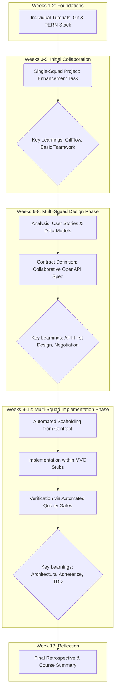
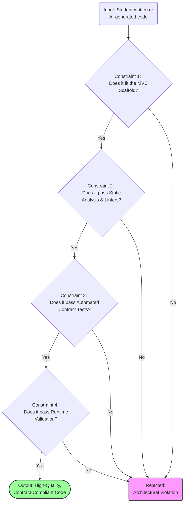

# Proposed Diagrams for the Paper

This document contains three proposed diagrams to visually support the key concepts in our paper. Each diagram is presented in Mermaid syntax for easy integration and editing.

---

### **Diagram 1: The Pedagogical Framework (Educator's Perspective)**

**Purpose:** This high-level flowchart provides an educator-centric view of the entire 13-week course. It illustrates the scaffolding of complexity, showing how students progress from individual tasks to full multi-squad collaboration. This diagram would fit well in **Section 3 (The Pedagogical Framework)** to give readers a map of the student journey.



---

### **Diagram 2: The Design-First Technical Workflow (Technical Perspective)**

**Purpose:** This diagram provides a detailed, technical view of the core design-first process for the main "Galleria" project. It explicitly shows the artifacts, activities, and tools involved, making the entire workflow tangible for the reader. This is a critical diagram and would be best placed in **Section 4 (Constraining AI)** to illustrate the system of constraints.

```mermaid
graph TD
    A[Project Requirements Document] --> B(1. Requirements Analysis);
    
    subgraph "Phase 1: Design (in Moqups)"
        B --> C{User Stories};
        B --> D{Data Models};
    end

    C --> E[2. Collaborative Contract Definition];
    D --> E;

    subgraph "Phase 2: Contract as Source of Truth"
        E --> F([openapi.yaml]);
    end

    subgraph "Phase 3: Automated Generation"
        F -- feeds --> G(Custom Handlebars Templates);
        G -- generates --> H(Application Scaffold: MVC, Stubs);
    end

    subgraph "Phase 4: Implementation & Verification"
        I(Student Code in Stubs) -- creates --> J(Pull Request);
        H -- is filled by --> I;
        
        subgraph CI/CD Pipeline (GitHub Actions)
            J --> K{Gate 1: Linters 
(ESLint, Hoover)};
            K -- on pass --> L{Gate 2: Contract Tests 
(Postman, Newman)};
            L -- on pass --> M{Gate 3: Architectural Rules 
(dependency-cruiser)};
            M -- on pass --> N[Merge to Develop];
        end

        subgraph Runtime Constraint
             O(Live Application) -- request/response --> P{Gate 4: OpenAPI Validator 
(Middleware)};
        end
    end
```

---

### **Diagram 3 (Suggested): The "Constraint Funnel" Conceptual Model**

**Purpose:** The idea that the framework "constrains AI" is the most novel part of our paper, but it can be abstract. This conceptual diagram visualizes how the layers of the framework act as a funnel, filtering raw or AI-generated code to produce high-quality, compliant output. It makes the core argument of **Section 4** immediately understandable.


