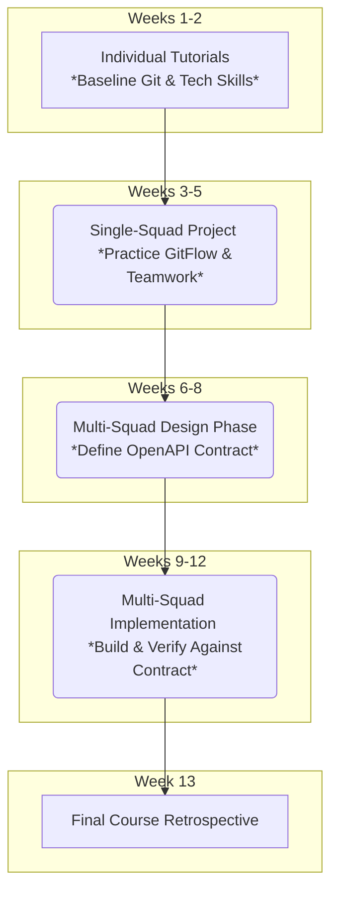
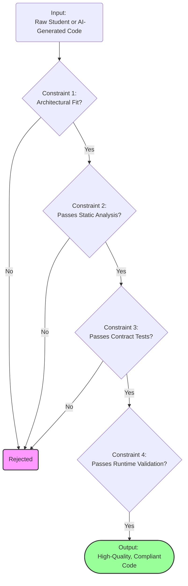

# Proposed Diagrams and Tables for the Paper

This document contains revised, more concise diagrams and a set of proposed tables to clearly and efficiently present the paper's key information.

---

## **Revised (Concise) Diagrams**

Here are the updated diagrams, simplified for clarity and impact.

### **Diagram 1: The Pedagogical Framework (Educator's Perspective)**

**Note on Conciseness:** The key learnings are now integrated directly into the activity blocks to reduce the number of nodes and create a cleaner flow.



### **Diagram 2: The Design-First Technical Workflow (Technical Perspective)**

**Note on Conciseness:** The CI/CD Pipeline is now abstracted into a single process block. The detailed steps within the pipeline are better represented in the new **Table 2** below, which is a clearer format for that information.

```mermaid
graph TD
    A[Project Requirements] --> B(1. Analysis & Design);
    B --> C([openapi.yaml]);
    C -- feeds --> D(2. Automated Scaffolding);
    D -- generates --> E(MVC Application Stubs);
    E --> F(3. Student Implementation);
    F -- creates --> G(Pull Request);
    G --> H{{4. Automated Quality Gates <br> (CI/CD Pipeline)}};
    H -- on pass --> I([Merged Code]);

    style H fill:#f9f,stroke:#333,stroke-width:2px
```

### **Diagram 3: The "Constraint Funnel" Conceptual Model**

**Note on Conciseness:** This diagram is already conceptual. The text has been slightly tightened for clarity.



---

## **Proposed Tables**

Tables are excellent for presenting structured details concisely. Here are three suggestions.

### **Table 1: Course Structure and Learning Objectives**

**Purpose:** This table complements Diagram 1. While the diagram shows the flow, this table provides the details for each phase, connecting activities to their pedagogical goals. It would fit well in **Section 3.1 (Course Structure)**.

| Phase | Weeks | Key Activities | Primary Learning Objectives |
| :--- | :--- | :--- | :--- |
| **1. Foundations** | 1-2 | Individual Tutorials (Git, PERN) | Establish baseline technical competency. |
| **2. Initial Collab.** | 3-5 | Single-Squad Enhancement Task | Practice GitFlow and basic teamwork in a low-dependency setting. |
| **3. System Design** | 6-8 | Multi-squad requirements analysis; Collaborative OpenAPI contract definition. | Learn API-first design, cross-team negotiation, and specification. |
| **4. System Impl.** | 9-12 | Implement logic in scaffolded stubs; Verify via automated quality gates. | Adhere to architecture, practice TDD, and respond to CI/CD feedback. |
| **5. Reflection** | 13 | Final project retrospective. | Synthesize learnings on process, teamwork, and design. |

### **Table 2: Automated Quality Gates in the CI/CD Pipeline**

**Purpose:** This table replaces the complex subgraph in the original Diagram 2. It clearly and concisely lists each automated check, the tool used, and its function. This is perfect for **Section 4.2 (Automated Quality Gates)**.

| Gate | Tool(s) | Purpose / Check Performed |
| :--- | :--- | :--- |
| **1. Static Analysis** | ESLint, Hoover | Enforces consistent code style and OpenAPI specification best practices. |
| **2. Arch. Rules** | dependency-cruiser | Prevents direct cross-squad code imports, enforcing API-only communication. |
| **3. Contract Tests** | Postman / Newman | Executes automated tests to validate that each endpoint's functionality matches the contract. |
| **4. Runtime Validation**| OpenAPI Validator | (Middleware) Intercepts live requests/responses to ensure they conform to the contract schema. |

### **Table 3: Mapping Research Questions to Evidence**

**Purpose:** This table provides a powerful, concise summary of our research methodology. It explicitly connects each research question to the data sources and metrics used to answer it, greatly strengthening the credibility of our results. This would be an excellent addition to **Section 5 (Methodology)**.

| Research Question (RQ) | Primary Data Source(s) | Key Metrics / Analysis Type |
| :--- | :--- | :--- |
| **RQ1: Collaboration** | GitHub Logs (Commits, PRs) | **Quantitative:** Contribution balance, fetch-to-push ratio, PR comment depth, emergent role analysis. |
| **RQ2: Quality** | CI/CD Logs, Source Code | **Quantitative:** CI/CD failure rate (25.6%), PR merge rate (83%), static analysis of code evolution. |
| **RQ3: AI Perception** | Retrospectives, Slack, Grades | **Qualitative:** Thematic analysis of student feedback. **Mixed:** Correlating CI/CD failures with student comments and grades. |
